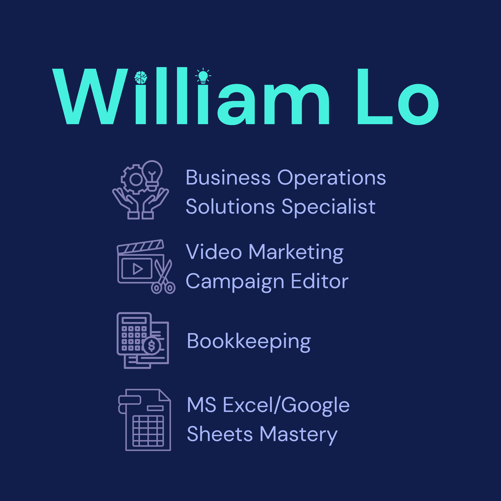

# Welcome to My Portfolio!

## Crafting Seamless User Experiences with Impactful Design

### About Me
Hello! I am William Lo, an incoming Second Year BSA student who has a passion for managing operations, keeping track of cash flows, and solving problems!

### My Design Choice
The reason I stuck with my design choice and branding is that it is a mix of personal preference and a belief that this branding perfectly captures who I am as a person and what I am able to bring in a potential
workspace. I believe my branding conveys professionalism while not being necessarily dull or boring. I think that everything comes off as clean, modern, professional, and aesthetic.

---

## 📁 Featured Projects

